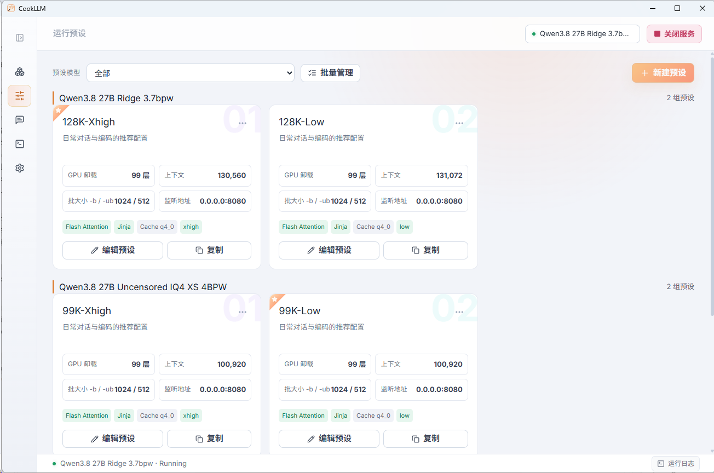

# 🦙 CookLLM

> **本地大模型服务调度器** —— 专为 `llama.cpp` / `GGUF` 打造的现代化 Windows 桌面管理工具。
> 模型仓库、运行预设、一键启停、GPU 监控、实时日志与内嵌 WebUI 会话，一站式解决本地推理的日常管理。

---

## 📸 界面一览

### 🏠 主界面 · 模型仓库

导入并管理所有本地 GGUF 模型：拖拽即可收录，自动解析架构 / 参数量 / 量化格式，支持搜索、重命名、排序与批量管理。


### 🎛 运行预设

为每个模型维护独立的运行参数方案,可手工精细化调参、克隆或自定义 CLI 参数。



### 📟 实时日志

实时捕获 `llama-server` 的 `stdout` / `stderr`，按 ERR / WRN / SYS / OUT 分级染色，支持底部 Dock 抽屉与整页日志两种视图。


### 💬 会话 · 内嵌 WebUI

服务启动后内嵌 llama.cpp 官方 WebUI，开箱即聊；同时本地暴露 OpenAI 兼容的 `/v1` 接口，可无缝对接任意第三方客户端。


---

## ✨ 核心特性

### 🗂 模型仓库

- **便捷导入**：拖放文件 / 目录或原生文件选择，自动递归扫描，仅收录 `.gguf`
- **智能解析**：从文件名自动提取模型架构、参数量与量化格式（如 `Q4_K_M`）
- **精细管理**：多维搜索（名称 / 路径 / 架构）、重命名、拖拽排序、快速移除与默认模型设定
- **批量操作**：批量选择与删除，配合左侧模型数量徽标一目了然

### 🎛 运行预设

- **深度参数**：GPU 卸载层数、上下文长度、Batch / uBatch、Flash Attention、KV Cache 类型、Jinja 模板、Reasoning 强度（auto / low / medium / high）、mmap 加载与采样参数
- **灵活扩展**：预设新建、克隆、删除，并支持自定义 CLI 额外参数注入

### 🚀 一键启停与进程管控

- Rust 原生托管 `llama-server` 子进程，状态自动轮询（PID / 端口），顶部一键启停
- 停止时采用 `taskkill /T /F` 强制终结完整进程树，彻底告别显存卡死

### 📈 GPU 实时监控

- 基于 `nvidia-smi` 轮询显存占用与 GPU 核心负载，2 秒刷新
- 侧边栏迷你状态卡 + 顶部 GPU 性能监测条，带 3 分钟滚动趋势迷你图

### 📟 实时日志系统

- 实时捕获 `stdout` / `stderr`，按 **ERR / WRN / SYS / OUT** 级别彩色渲染
- 底部高度自适应的控制台抽屉，与独立的整页日志视图，支持一键清空

### 💬 会话与 OpenAI 兼容

- 服务启动后内嵌 llama.cpp 官方 WebUI，代码块复制、外部链接（GitHub / HuggingFace 等）均可在系统浏览器打开
- 本机暴露标准 `/v1/chat/completions` 接口，可持续对接各类第三方客户端

### ⚙️ 纯本地与隐私保障

- **零遥测**：模型索引、预设配置与会话历史 100% 留存在本机
- **健壮存储**：配置采用原子写入（临时文件 + rename），避免意外损坏
- **主题切换**：亮色 / 暗色主题一键切换，立即生效并持久化

---

## 🛠 技术架构

| 模块 | 技术选型 | 说明 |
| :--- | :--- | :--- |
| **桌面框架** | [Tauri 2](https://tauri.app/)（Rust） | 轻量原生内核，解决启动白屏 / 黑屏问题 |
| **前端技术** | React 19 · TypeScript · Vite 6 · Tailwind CSS 4 | 现代化响应式单页架构 |
| **后端运行时** | Rust Core | 子进程生命周期管理、日志管道转发、配置原子写入 |
| **推理引擎** | llama.cpp（`llama-server.exe`） | 本地 GGUF 模型高性能推理 |
| **打包分发** | NSIS / WiX | Windows 原生安装包与免安装便携版 |

---

## 📁 目录结构

```text
├── index.html              # Splash 启动页与 HTML 入口
├── src/                    # 前端项目（React + TypeScript）
│   ├── App.tsx             # 顶层状态与全局事件调度
│   ├── tauri.ts            # Tauri API / 事件桥
│   ├── data.ts             # 默认预设模板、迁移脚本与演示数据
│   ├── components/         # 模型卡片、预设编辑器、日志、会话等组件
│   └── types.ts            # 全局 TypeScript 类型定义
└── src-tauri/              # 后端项目（Rust + Tauri 2）
    ├── src/lib.rs          # 进程管控、日志监听、文件扫描与配置管理
    ├── tauri.conf.json     # Tauri 基础配置
    └── capabilities/       # 安全策略与窗口权限声明
```

---

## 🚀 快速上手

1. 打开 **设置**，指定本机的 `llama-server.exe` 路径
2. 将 `.gguf` 模型拖入 **模型仓库**
3. 选择合适的 **运行预设**，点击 **启动服务**
4. 在 **会话** 面板中即刻体验，或通过本地 `http://127.0.0.1:8080/v1` 接入其他应用

---

## 💻 本地开发与构建

**前置准备**

- Windows 10 / 11（x64）
- Node.js 18+ 与 Rust 工具链（MSVC）
- 已编译的 `llama-server.exe` 与 GGUF 模型

**开发调试**

```bash
# 安装依赖
npm install

# 启动桌面端热重载开发
npm run tauri dev
```

**生产构建**

```bash
# 生成发布安装包（位于 src-tauri/target/release/）
npm run tauri build
```

---

## 📄 开源协议

本项目采用 [MIT License](LICENSE) 授权。