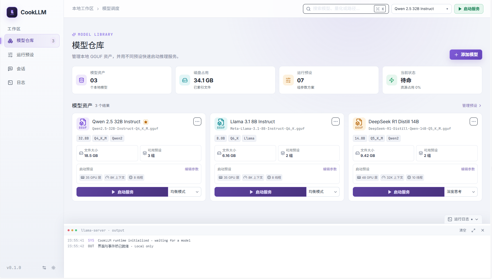

# CookLLM

**本地大模型服务调度器** —— 一个管理 llama.cpp / GGUF 本地模型的 Windows 桌面工具：模型仓库、运行预设、一键启停服务、实时日志、内置会话。



## 核心特性

- 🗂 **模型仓库**
  - 多种方式导入 GGUF 模型：直接拖拽文件 / 文件夹进窗口、文件选择、整文件夹选择（递归扫描子目录、自动去重）
  - 从文件名自动识别量化（`Q4_K_M` 等）与参数量
  - 搜索（名称 / 架构 / 量化 / 路径）、重命名、移除、设置默认启动模型
  - 每个模型拥有独立的运行预设集合
- 🎛 **运行预设**
  - 内置三套开箱即用：**均衡模式**、**深度思考**、**低显存**
  - 可调项：GPU 卸载层数、上下文长度、线程数、并行数、batch / ubatch、Flash Attention、KV cache 类型、jinja、推理模式（on / off / auto + effort）、加载模式（mmap）、采样参数（temperature / top_p / min_p / repeat_penalty），以及任意额外 CLI 参数
  - 支持编辑 / 复制 / 删除，可指定每个模型的默认预设
- 🚀 **一键启停**
  - 一键启动 / 停止 `llama-server`，由 Rust 后端在进程内托管子进程
  - 停止时强制结束整个进程树（`taskkill /T /F`）并带超时等待，不再卡死显存
  - 自动轮询服务状态，显示 PID / 端口
- 📟 **实时日志**
  - 实时抓取 `llama-server` 的 stdout / stderr
  - 按 llama.cpp 日志级别着色：**ERR / WRN / SYS / OUT**
  - 底部可拖拽调节高度的控制台抽屉 + 完整日志页
- 💬 **内置会话**
  - 通过 OpenAI 兼容的 `/v1/chat/completions` 直接测试当前模型
  - 对话历史自动持久化（最近 200 条）
  - 一键跳转 llama.cpp Web UI
- 🔌 **OpenAI 兼容 API**
  - 服务启动后在本地端口暴露标准 `/v1` 端点，可直接被其他本地应用调用
- ⚙️ **偏好设置**
  - 指定 `llama-server.exe` 路径、暗色 / 亮色主题
  - 配置以 JSON 原子写入（临时文件 + rename），存于本机应用配置目录
- 🕵️ **纯本地**
  - 无云依赖、无遥测、无数据上传：模型索引、预设、对话历史全部保存在本机

## 技术栈

| 层 | 技术 |
| --- | --- |
| 桌面框架 | [Tauri 2](https://tauri.app/)（Rust） |
| 前端 | React 19 · TypeScript · Vite 6 · Tailwind CSS 4 |
| 后端 | Rust —— 子进程管理、配置原子写入、日志事件转发 |
| 运行时 | llama.cpp `llama-server`（GGUF 模型） |
| 打包 | NSIS / WiX 安装包（Windows） |

### 技术结构

- **前端**（`src/`）：React 单页应用，包含 模型仓库 / 运行预设 / 会话 / 日志 / 偏好设置 五个工作区；通过 `src/tauri.ts` 与 Rust 后端的命令 / 事件桥通信；在浏览器环境中自动降级为演示模式（localStorage + 模拟日志）
- **后端**（`src-tauri/src/lib.rs`）：Rust 核心，职责包括：
  - `start_server` / `stop_server`：spawn `llama-server` 子进程，按「模型 + 预设」组装全部 CLI 参数；停止时 `taskkill /T /F` 整树强杀 + 超时等待
  - 日志管道：独立线程读取 stdout / stderr → `app.emit("llama-log")` → 前端实时渲染
  - 配置读写：`config.json` 存于 `%APPDATA%\dev.cookllm.launcher\`，原子写入防损坏
  - 模型导入：系统文件对话框 + 拖放事件，递归扫描 `.gguf`（Windows 下大小写不敏感去重）
  - 启动黑屏治理：窗口 `visible:false`，等前端首帧渲染后再显示，并带 8 秒兜底
- **数据**：配置与模型索引 → 本地 JSON；对话历史 → WebView localStorage

## 目录结构

```
├── index.html              # Splash 页与应用入口
├── src/                    # 前端（React + TypeScript）
│   ├── App.tsx             # 顶层状态与事件编排
│   ├── tauri.ts            # Tauri 命令 / 事件桥（含浏览器降级）
│   ├── data.ts             # 默认预设、示例模型、配置迁移
│   ├── types.ts · utils.ts # 类型与工具
│   ├── components/         # 侧栏 / 顶栏 / 模型卡片 / 预设编辑器 / 会话 / 日志
│   └── splash.css          # 启动画面样式
└── src-tauri/              # 后端（Rust + Tauri 2）
    ├── src/lib.rs          # llama-server 进程管理 / 配置 / 日志 / 文件导入
    ├── tauri.conf.json     # Tauri 配置
    └── capabilities/       # 窗口权限声明
```

## 快速上手

1. 在 **偏好设置** 中指定本机 `llama-server.exe` 的路径
2. 把 GGUF 模型拖进 **模型仓库**（或点导入）
3. 选择运行预设，点 **启动服务**
4. 在 **会话** 中直接测试，或用标准 `/v1` API 接入其他应用

## 本地构建

**前置条件**

- Windows 10 / 11、Node.js 18+、Rust 工具链（MSVC）
- 已构建的 llama.cpp（需要 `llama-server.exe`）
- 至少一个 GGUF 模型文件

**开发模式**

```bash
npm install
npm run tauri dev
```

**构建发布**

```bash
npm run tauri build
```

产物位于 `src-tauri/target/release/`（NSIS 安装包与独立 exe）。
