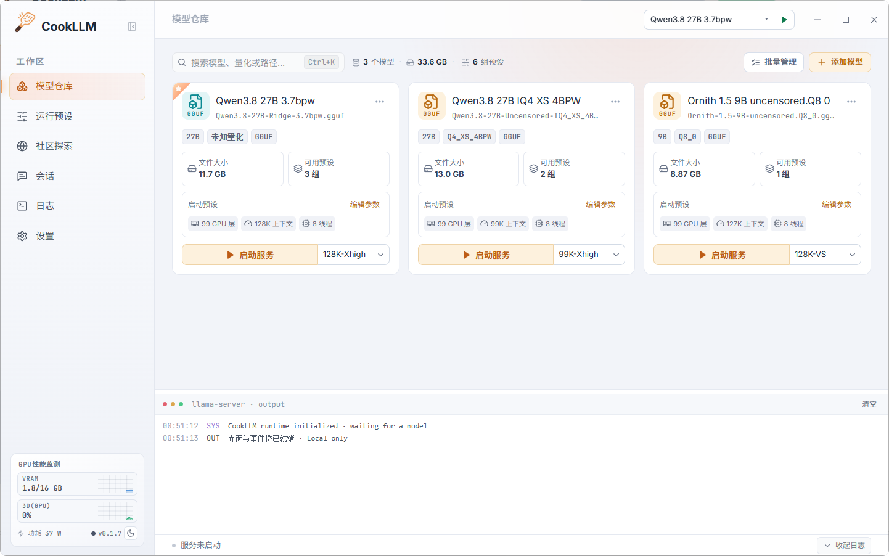
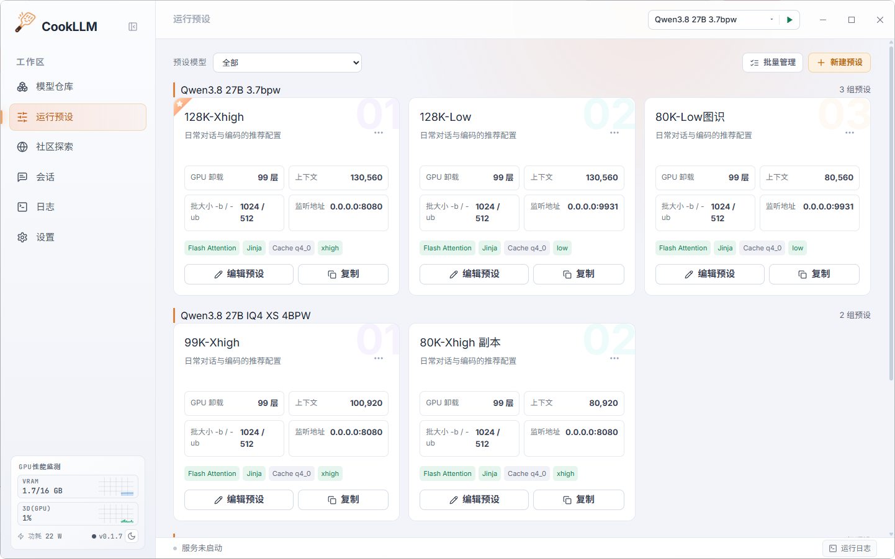
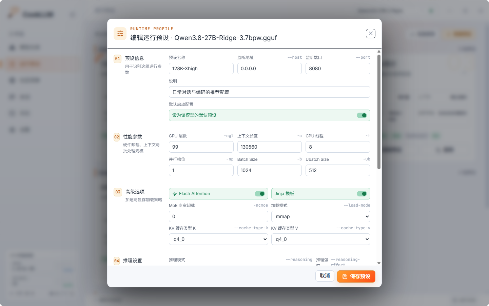
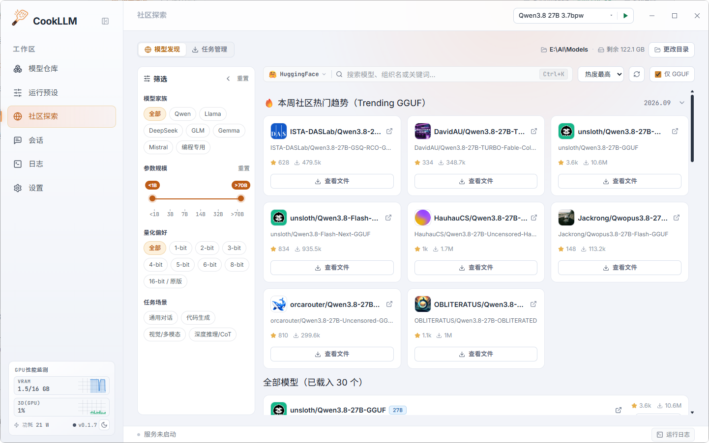
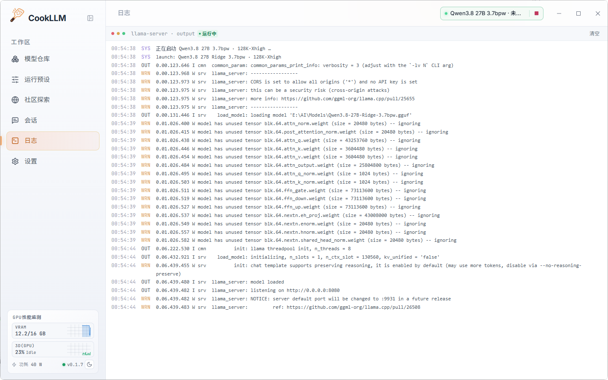
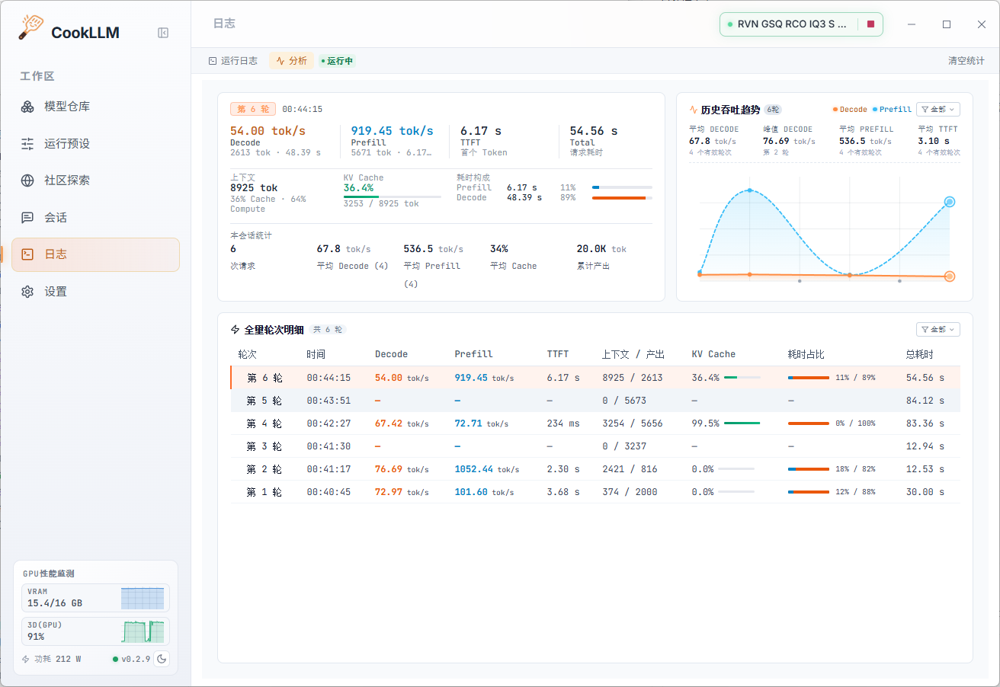
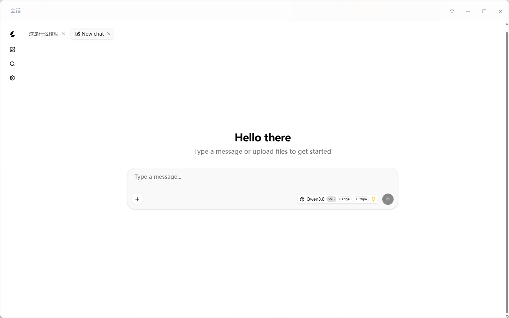

# 🦙 CookLLM

> **llama.cpp 轻量管理器** —— 面向 `llama.cpp` / GGUF 模型打造的 Windows 桌面管理程序。
> 内置模型库、运行参数模板、一键启停、显卡状态监控、实时运行日志以及内置对话网页，本地大模型日常调试管理一套搞定。

---

## ✅ 更新日志

### v0.3.2

#### 🚀 新增功能与体验优化

- **全面支持 NInfer / NInfer-KVMem 原生高性能引擎**
  - **引擎托管与智能识别**：支持登记并一键切换 NInfer 与 NInfer-KVMem 引擎分支，自动检测运行时架构与硬件加速后端。
  - **原生 .ninfer 模型解析**：支持直接导入并解析 .ninfer 格式模型，自动提取架构、参数量与量化信息，并自动生成对齐官方推荐的最佳实践预设。
  - **预设参数动态适配**：预设编辑器智能联动当前引擎，提供 KV 缓存量化（rk8v4 / int8 / bf16 / nvfp4）、预填充分块、快速预热内核、CUDA 显存策略、硬件 Profile 路由、KVMem 分层配额等专属调优参数。
  - **原生 MTP 投机解码**：支持自适应 MTP 投机采样与 N-gram 模式匹配加速，大幅提升长上下文推理吞吐。
  - **实时性能精准监控**：适配 NInfer 原生监控端点，实时统计瞬时 TPS、Prefill 吞吐速率与槽位占用。

- **双轨制模型格式视觉体系**
  - **全新专属格式徽标**：设计高辨识度的矢量标识体系——GGUF与 NINFER。
  - **差异化指标呈现**：模型卡片与列表动态适配，GGUF 模型展示显存卸载层数与线程，NInfer 模型直观呈现 KV 缓存量化类型与并发槽位数。

- **预设管理与编辑交互升级**
  - **格式分类标签页**：预设列表新增「全部 / GGUF / NINFER」多维筛选。
  - **双层字段布局**：中文名称与对应英文 CLI 参数纵向双层排布，彻底杜绝横向挤压与省略号截断；右上角新增快捷收藏与设为默认预设。

- **社区探索与模型导入**
  - **Hugging Face 格式筛选**：社区探索热门与搜索支持按模型格式（全部 / 仅 GGUF / 仅 NINFER）精确过滤并展示格式徽章。
  - **双格式统一导入**：模型导入窗口与拖拽区域全面兼容 .gguf 与 .ninfer 文件及文件夹。

- **控制台与实用工具**
  - **一键复制日志**：底部日志坞新增复制按钮，支持一键导出格式化时间戳与日志级别的纯文本内容到剪贴板。

### v0.3.1

- 新增 GGUF 文件头读取：模型架构、参数量、量化直接来自文件头，不再依赖文件名猜测
- 新增配置备份导出/导入：导入按路径合并、不覆盖本机已有模型，导出备份不含下载 Token
- 设置页「配置存储」改为「管理」下拉菜单（导出备份 / 导入备份 / 打开文件夹）
- 修复任务列表条目被压缩的问题

### v0.3.0

- 上线全新推理性能分析页 “日志-分析”
- 支持 Decode/Prefill 双轨监控与多维指标洞察
- 支持轮次锁定与多类型数据筛选
- 修复模型自定义标签与标签池重启后未持久化保存的问题

### v0.2.9

- 运行预设新增思考预算（--reasoning-budget）配置
- 视觉模型新增「挂载至内存」开关，不占显存更轻量
- 新增参数去重与防冲突处理

### v0.2.8

- 新增 CUDA 版本识别
- 客户端启动优化


## 📸 界面预览

### 🏠 主页・模型仓库

统一管理电脑上所有 GGUF 模型，直接拖拽文件就能导入，支持搜索、改名、排序以及批量操作。



### 🎛 运行预设

给不同模型保存独立的启动参数，手动精细调参、复制一套新配置，也可以自定义额外命令行参数。





### 🌍 社区探索

嵌入Hugging Face 每周模型榜单，支持筛选、搜索、下载及自动化入库



### 📟 实时日志

实时读取 `llama-server` 的输出数据、报错日志、全量轮次明细，既可在底部抽屉查看，也能切换到全屏日志页面。





### 💬 对话・内置网页对话界面

集成 llama.cpp 官方Webui，本地同时提供兼容 OpenAI 格式的 `/v1` 接口，可以对接任意第三方客户端。



---

## ✨ 核心功能

### 🗂 模型仓库

- **快速导入**：拖拽文件或文件夹，也可以手动选择路径，程序自动扫描目录，只识别 GGUF 格式文件
- **自动识别信息**：从文件名读取模型架构、参数量、量化等级（例如 `Q4_K_M`）
- **灵活管理**：按名称、路径、架构筛选搜索，支持重命名、拖拽排序、快速删除，还能设置默认启动模型
- **批量处理**：多选批量删除，左侧面板会直观展示模型数量

### 🎛 运行预设配置

- **完整可调参数**：GPU 分层加载显存、上下文窗口大小、批处理参数、Flash Attention、KV 缓存方案、Jinja 提示词模板、推理思考强度、内存映射加载以及采样相关配置全部支持自定义
- **自由扩展**：新建、复制、删除配置模板，额外补充自定义命令行启动参数

### 🚀 一键启停与进程管理

- 使用 Rust 托管 `llama-server` 子进程，自动检测进程 PID 和端口状态，顶部按钮一键开启关闭
- 停止服务时完整杀掉整个进程树，彻底解决显存占用无法释放的问题

### 📈 显卡实时监控

- 调用 `nvidia-smi` 定时读取显存占用与显卡负载，每 2 秒刷新一次数据
- 侧边小卡片 + 顶部性能条展示状态，附带三分钟负载波动小曲线图
- **开关可控**：程序会自动识别显卡类型，如果是 AMD 或者不支持读取状态的显卡，会给出提示，你可以关闭监控避免无用轮询

### 📟 实时日志面板

- 实时捕获程序输出和报错，按照 **ERR / WRN / SYS / OUT** 不同级别用不同颜色区分展示
- 底部可拉伸收起的控制台，还有独立全屏日志页面，支持一键清空日志

### 💬 对话能力与 OpenAI 兼容接口

- 服务启动后内置官方对话页面，外部链接调用系统浏览器打开跳转
- 本机提供标准的 `/v1/chat/completions` 接口，可以对接各类第三方对话工具

### ⚙️ 完全本地运行，保护隐私

- **不上传任何数据**：模型列表、参数配置、对话记录全部保存在你的电脑本地
- **安全写入配置**：采用临时文件替换写入机制，避免异常退出导致配置文件损坏
- **明暗双主题**：一键切换浅色 / 深色模式，设置自动保存生效

---
### 🧭 llama.cpp 引擎管理

- **自动识别**：启动检测 NVIDIA、Vulkan 环境，自动选用 CUDA/Vulkan/CPU 最优加速方案并显示显卡
- **一键更新**：拉取 llama.cpp 官方 Windows 版本，自动匹配后端与 CUDA 版本
- **断点续传**：下载解压实时显示进度，支持随时取消
- **安全更新**：临时目录预解压 + 备份回滚，升级失败不破坏原有程序，无需额外配置
- **强制修复**：同版本文件损坏时可重新下载安装

### 🌐 网络与代理

- **网络模式**：跟随系统 / 手动 HTTP/SOCKS5 代理 / 直连
- **手动代理**：填入如 `http://127.0.0.1:7890` 等代理地址，通过 `reqwest::Proxy::all` 动态注入所有请求
- **自动检测系统代理**：Windows 下读取注册表 `HKCU` 代理设置，代理失效 / 网络异常时多通道设下载可自动切换直连或本地代理重试
- **连接测试**：一键测试与 GitHub API 的连通性，显示状态码与延迟

### 🌍 社区探索（HuggingFace）

- **热门榜单**：展示当周 HuggingFace Trending GGUF 模型，支持刷新与收起
- **全量搜索**：支持搜索模型 / 组织 / 关键词，快速筛选标签（Qwen / Llama / DeepSeek / GLM / Gemma / 代码 / 视觉），可仅显示 GGUF、按热度 / 时间排序；列表支持触底分页加载，无限向下浏览
- **通用文件下载弹窗**：单击卡片即弹出文件列表（量化 Badge、文件大小、显存适配提示、一键加入下载队列），提示存储目录与剩余空间可随时更改
- **托管下载**：支持断点续传（`.part` 临时文件）、实时速率 / 进度 / 剩余时间显示，异常任务可重试
- **自动入库**：下载完成后自动扫描解析 GGUF 并入库，在模型仓库第一位显示「刚刚下载」标识

## 🛠 技术架构

| 模块 | 技术方案 | 说明 |
| :--- | :--- | :--- |
| **桌面程序框架** | [Tauri 2](https://tauri.app/)（Rust） | 原生轻量内核 |
| **前端页面** | React 19 · TypeScript · Vite 6 | 现代化响应式单页界面 |
| **后端核心** | Rust Core | 负责进程管控、日志转发、文件扫描与安全保存配置 |
| **推理底层** | llama.cpp（`llama-server.exe`） | 本地高速运行 GGUF 大模型 |
| **打包安装程序** | NSIS / WiX | 提供 Windows 安装包 |

---

## 📁 项目目录说明

```text
├── index.html              # 启动闪屏页与页面入口
├── src/                    # 前端代码（React + TypeScript）
│   ├── App.tsx             # 全局状态管理与事件分发
│   ├── tauri.ts            # Tauri 接口与前后端事件通信
│   ├── data.ts             # 默认参数模板、版本迁移脚本、示例数据
│   ├── components/         # 模型卡片、参数编辑器、日志面板、对话界面等组件
│   └── types.ts            # 全局 TypeScript 类型声明
└── src-tauri/              # Rust 后端工程（Tauri 2）
    ├── src/lib.rs          # 进程控制、日志监听、文件扫描、配置读写逻辑
    ├── tauri.conf.json     # Tauri 基础配置文件
    └── capabilities/       # 安全权限、窗口访问策略定义
```

---

## 🚀 快速上手使用

1. 打开**设置页面**，填写你电脑里 `llama-server.exe` 的完整路径
2. 把 GGUF 模型文件拖拽到**模型仓库**
3. 选择一套合适的**运行预设**，点击**启动服务**
4. 直接切换到**对话**面板开始聊天；也可以通过本地地址 `http://127.0.0.1:9931/v1` 对接其他软件

---

## 💻 本地开发编译

**环境依赖**

- Windows 10 / 11（x64 系统）
- Node.js 18+ 以及带 MSVC 编译工具的 Rust 开发环境
- 提前编译好的 `llama-server.exe` 和 GGUF 模型文件

**开发调试**

```bash
# 安装前端依赖
npm install

# 启动桌面端热更新调试模式
npm run tauri dev
```

**打包正式版本**

```bash
# 编译生成安装包，输出目录 src-tauri/target/release/
npm run tauri build
```

---

## 👥 社区与支持

访问 [LINUX DO](https://linux.do)，与开发者和技术爱好者交流。

---

## 📄 开源许可

本项目遵循 [MIT License](LICENSE) 开源协议分发。
